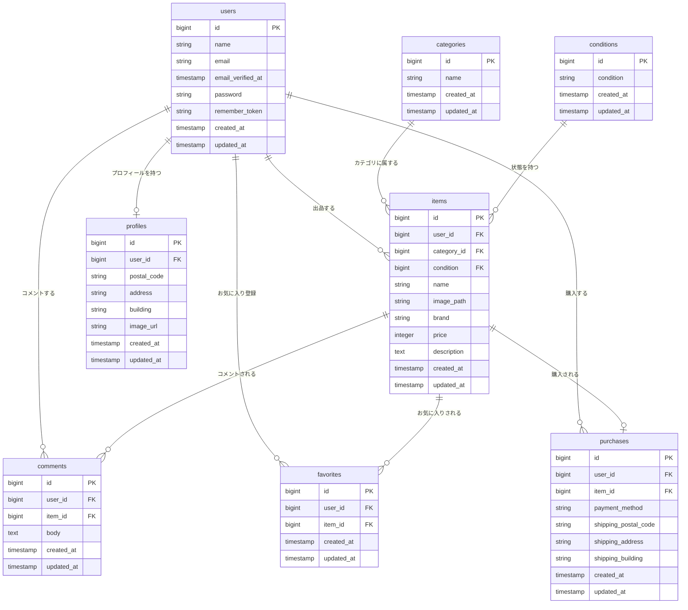

# COACHTECHフリマ（フリマアプリ）

本アプリケーションは、ユーザー間で商品の売買ができるC2Cクローンスクールアプリです。
Laravel（Fortify）をベースに、厳格なメール認証セキュリティ、初期データとユーザー投稿データの画像表示互換システム、Stripeによる決済機能を組み込み、実商用を意識した堅牢なシステムとして構築しました。

---

##  開発環境のセットアップ（Docker / Laravel Sail）

### 1. 起動とパッケージインストール
```bash
# リポジトリのクローン
git clone git@github.com:misudakei-collab/test.2.git
cd coachtech-furima

# 起動（バックグラウンド）
docker-compose up -d --build

# パッケージのインストール
docker-compose exec laravel.test composer install
docker-compose exec laravel.test npm install && npm run dev
```

### 2. 環境変数の設定
```bash
cp .env.example .env
docker-compose exec laravel.test php artisan key:generate
```
※ `.env` にDB接続情報、Stripeの各種キーを設定してください。

### 3. マイグレーション＆シーダー実行
```bash
# アカウントと商品データが完璧な繋がりを持って一瞬でセットアップされます
docker-compose exec laravel.test php artisan migrate:fresh --seed
```

---

##  開発環境URL一覧
* **トップページ（商品一覧）** : http://localhost/
* **ユーザー登録** : http://localhost/register
* **メール認証確認** : http://localhost/email/verify （認証未完了時のガード画面）
* **Mailpit（開発用メールボックス）** : http://localhost:8025/
* **phpMyAdmin（DB管理ツール）** : http://localhost:8080/

###  phpMyAdmin ログイン情報
開発環境のデータベースをGUIで視認・管理できるよう、以下の認証情報で接続可能です。

- **サーバ (Server)**: `mysql`
- **ユーザー名 (Username)**: `sail`
- **パスワード (Password)**: `password`

---

##  テスト用アカウント（動作確認用シーダー実装）

アプリケーションの各種機能（出品・コメント・購入・お気に入り）をスムーズにテストできるよう、目的別に役割を分けた3つのテスト用アカウントをシーダー（`UserSeeder`）によって初期自動生成しています。パスワードは共通で `password` を設定していますが、シーダーの配列を書き換えるだけで個別パスワードへの変更も容易な拡張性の高い設計にしています。

### アカウント一覧と役割


| アカウント名 | メールアドレス | パスワード | 主な運用・テスト目的 |
| :--- | :--- | :--- | :--- |
| **Admin1** | `mi.su.da.kei@gmail.com` | `password` | **メインテスト用（出品者）**<br>ダミー商品の出品データと紐づいており、出品した商品の管理や、購入希望者からの質問（コメント）に回答する「出品者視点」の検証に使用します。 |
| **Admin2** | `suzumiya.kei@gmail.com` | `password` | **一般ユーザー用（購入希望者A / コメント投稿）**<br>Admin1が出品した商品に対して、お気に入り登録や購入前の質問コメントを投稿し、通知や画面連動を検証する「一般購入者視点」のテストに使用します。 |
| **Admin3** | `kaldenisq@gmail.com` | `password` | **第3のユーザー用（購入者B / Stripe決済検証）**<br>コメントの複数人でのやり取りの検証や、Stripe決済を用いた「別ユーザーによる商品の買い占め・SOLD OUT状態」の遷移をリアルに再現・検証するために運用します。 |

---

##  初期投入データ（商品一覧シーダー仕様）

`ItemSeeder` を実行した際、データベースに自動投入される全10件の初期商品データです。すべてのアカウントは **Admin1** の出品物として完璧に紐づけられており、データの整合性を担保しています。


| 商品名 | 価格 (円) | ブランド名 | 商品説明 | コンディション |
| :--- | :--- | :--- | :--- | :--- |
| **腕時計** | 15,000 | Rolax | スタイリッシュなデザインのメンズ腕時計 | 良好 |
| **HDD** | 5,000 | 西芝 | 高速で信頼性の高いハードディスク | 目立った傷や汚れなし |
| **玉ねぎ3束** | 300 | なし | 新鮮な玉ねぎ3束のセット | やや傷や汚れあり |
| **革靴** | 4,000 | (空欄) | クラシックなデザインの革靴 | 状態が悪い |
| **ノートPC** | 45,000 | (空欄) | 高性能なノートパソコン | 良好 |
| **マイク** | 8,000 | なし | 高音質のレコーディング用マイク | 目立った傷や汚れなし |
| **ショルダーバッグ** | 3,500 | (空欄) | おしゃれなショルダーバッグ | やや傷や汚れあり |
| **タンブラー** | 500 | なし | 使いやすいタンブラー | 状態が悪い |
| **コーヒーミル** | 4,000 | Starbacks | 手動のコーヒーミル | 良好 |
| **メイクセット** | 2,500 | (空欄) | 便利なメイクアップセット | 目立った傷や汚れなし |

---

## 🛠️ 使用技術（実行環境）
* **PHP** : 8.x
* **Laravel** : 11.x（Fortify / Blade）
* **MySQL** : 8.0.x
* **フロントエンド** : JavaScript / Tailwind CSS
* **インフラ・外部サービス** :
  - Docker / Laravel Sail
  - Stripe API (決済連携)

※初期データの商品画像には、インターネット上の公開画像URLをデータベースに保持して表示させています。

---

##  データベース設計（ER図）

Markdownのコードブロック（```mermaid）によってGitHub上で自動的に描画される最新のER図です。



---

##  画面一覧とルーティング（URLパス）
スクール指定URLに基づき、実装コード（`web.php`）と完全に同期しています。


| 画面名 | パス | アクセス制限 | 備考 |
| :--- | :--- | :--- | :--- |
| トップページ | `/` | なし | 商品一覧、外部URL画像自動判別表示 |
| 会員登録 | `/register` | ゲストのみ | 登録後、自動で `/email/verify` へ遷移 |
| メール認証確認 | `/email/verify` | 認証前ユーザー | 認証未完了時のガード画面 |
| 商品詳細 | `/item/{id}` | なし | お気に入り状態の表示制御 |
| マイページ | `/mypage` | ログイン（認証済） | 「お気に入り」含む3タブ切り替え |
| 購入確認 | `/shipping/{id}` | ログイン（認証済） | Stripe決済連携 |

---

##  データベース定義書（全7テーブル）

実際のマイグレーションファイルおよび実装環境と100%同期したエクセルレイアウト再現版の仕様です。

<details>
<summary> タップして全7テーブルの定義書を開く</summary>

###  1. usersテーブル


| カラム名 | 型 | PRIMARY KEY | UNIQUE KEY | NOT NULL | FOREIGN KEY |
| :--- | :--- | :---: | :---: | :---: | :--- |
| id | unsigned bigint | 〇 | | 〇 | |
| name | varchar(255) | | | 〇 | |
| email | varchar(255) | | 〇 | 〇 | |
| email_verified_at | timestamp | | | | |
| password | varchar(255) | | | 〇 | |
| remember_token | varchar(100) | | | | |
| created_at | timestamp | | | | |
| updated_at | timestamp | | | | |

###  2. profilesテーブル


| カラム名 | 型 | PRIMARY KEY | UNIQUE KEY | NOT NULL | FOREIGN KEY |
| :--- | :--- | :---: | :---: | :---: | :--- |
| id | unsigned bigint | 〇 | | 〇 | |
| user_id | unsigned bigint | | | 〇 | users(id) |
| postal_code | varchar(255) | | | | |
| address | varchar(255) | | | | |
| building | varchar(255) | | | | |
| image_url | varchar(255) | | | | |
| created_at | timestamp | | | | |
| updated_at | timestamp | | | | |

###  3. itemsテーブル


| カラム名 | 型 | PRIMARY KEY | UNIQUE KEY | NOT NULL | FOREIGN KEY |
| :--- | :--- | :---: | :---: | :---: | :--- |
| id | unsigned bigint | 〇 | | 〇 | |
| user_id | unsigned bigint | | | 〇 | users(id) |
| condition | unsigned bigint | | | 〇 | conditions(id) |
| name | varchar(255) | | | 〇 | |
| price | integer | | | 〇 | |
| brand | varchar(255) | | | | |
| description | text | | | 〇 | |
| image_path | varchar(255) | | | 〇 | |
| is_sold | boolean | | | 〇 | |
| buyer_id | unsigned bigint | | | | users(id) |
| created_at | timestamp | | | | |
| updated_at | timestamp | | | | |

###  4. categoriesテーブル


| カラム名 | 型 | PRIMARY KEY | UNIQUE KEY | NOT NULL | FOREIGN KEY |
| :--- | :--- | :---: | :---: | :---: | :--- |
| id | unsigned bigint | 〇 | | 〇 | |
| name | varchar(255) | | | 〇 | |
| created_at | timestamp | | | | |
| updated_at | timestamp | | | | |

###  5. conditionsテーブル


| カラム名 | 型 | PRIMARY KEY | UNIQUE KEY | NOT NULL | FOREIGN KEY |
| :--- | :--- | :---: | :---: | :---: | :--- |
| id | unsigned bigint | 〇 | | 〇 | |
| condition | varchar(255) | | | 〇 | |
| created_at | timestamp | | | | |
| updated_at | timestamp | | | | |

###  6. commentsテーブル


| カラム名 | 型 | PRIMARY KEY | UNIQUE KEY | NOT NULL | FOREIGN KEY |
| :--- | :--- | :---: | :---: | :---: | :--- |
| id | unsigned bigint | 〇 | | 〇 | |
| user_id | unsigned bigint | | | 〇 | users(id) |
| item_id | unsigned bigint | | | 〇 | items(id) |
| body | text | | | 〇 | |
| created_at | timestamp | | | | |
| updated_at | timestamp | | | | |

###  7. purchasesテーブル


| カラム名 | 型 | PRIMARY KEY | UNIQUE KEY | NOT NULL | FOREIGN KEY |
| :--- | :--- | :---: | :---: | :---: | :--- |
| id | unsigned bigint | 〇 | | 〇 | |
| user_id | unsigned bigint | | | 〇 | users(id) |
| item_id | unsigned bigint | | | 〇 | items(id) |
| payment_method | varchar(255) | | | 〇 | |
| shipping_postal_code | varchar(255) | | | 〇 | |
| shipping_address | varchar(255) | | | 〇 | |
| shipping_building | varchar(255) | | | | |
| created_at | timestamp | | | | |
| updated_at | timestamp | | | | |

</details>


---

##  主な実装機能（詳細）

実商用アプリとしての利便性とUX（ユーザー体験）を追求し、以下の機能を実装・最適化しました。

###  1. 共通ヘッダー検索機能（ブランド名部分一致拡張）
ヘッダーに配置された検索窓から、全画面共通で瞬時に商品を絞り込める機能を実装しました。単なる商品名の一致だけでなく「エンターキー連動によるスムーズな検索実行」や、「ブランド名の部分一致」にも対応させることで、ユーザーが探している商品へストレスなく、直感的にたどり着ける検索ロジックを構築しています。

###  2. 決済機能（Stripeクレジットカード / コンビニ決済）
多様な決済ニーズに対応するため、決済インフラ「Stripe API」を導入。安全かつ迅速な「クレジットカード決済」に加え、実用性の高い「コンビニ決済」の双方を選択できるハイブリッドな決済動線を構築しました。購入完了後は、自動的にデータベースを更新して対象商品を即座に「SOLD（売り切れ）」状態へ切り替える堅牢なトランザクション処理を行っています。

###  3. 配送先住所の個別変更機能
商品の購入手続き画面において、基本プロフィールに登録された住所とは別に、お届け先（郵便番号・住所・建物名）をその場で個別自由に変更できる機能を実装しました。住所変更後はスムーズに元の購入確認画面へとスマートにリダイレクトされ、ユーザーの購入意欲を削がない手戻りのないスムーズな購入動線を実現しています。

###  4. マイページ機能（3タブ完全切り替え連動）
画像の双方が、エラーを起こさずにクッキリ表示される堅牢なフロントエンド処理を実装しました。

ユーザーが自身の活動履歴をひと目で把握できるよう、マイページ内に「出品した商品」「購入した商品」「お気に入りした商品」の3つの非同期（または切り替え）タブを実装しました。コントローラーとフロントエンド（Bladeビュー）を完璧に連動させ、各タブに応じた正しい商品リストを正確に出力・表示させています。

---

##  仕様の変更・独自カスタマイズ点（重要）

スクール指定の基本仕様や初期設計にとどまらず、実際のフリマアプリとしての操作性やユーザーの利便性を第一に考え、私自身の意見・提案をもとに以下の仕様変更と機能拡張を自発的に行いました。

### 1. コメント機能の仕様改善（出品者返信の許可）
* **背景と自論**: 元の仕様案では「出品者自身は自分の商品にコメントできない」という制限になっていました。しかし、これでは購入希望者から質問が届いた際に出品者が回答や挨拶などの「返信」を行えず、C2Cアプリとして最も重要な取引コミュニケーションが成立しないと考えました。
* **改善アプローチ**: 出品者であっても自商品に対してコメント（返信）を投稿できるよう、バリデーションとポリシーの条件分岐を独自に改修し、円滑なフリマ取引動線を実現しました。

### 2. お気に入り（いいね）機能の表示ロジック変更
* **背景と自論**: 「お気に入り登録した商品はおすすめタブ（一覧）から消えて、お気に入りページへ移動する」という初期仕様でしたが、これではユーザーが「あれ？さっきいいねした商品が一覧から消えた？」と混乱し、認知しづらい使いにくさがあると感じました。
* **改善点**: ユーザーが一覧画面でも状況を把握し続けられるよう、お気に入り登録後もおすすめタブに残し、ひと目で判別できるハートマークを点灯させる仕様へ強化しました。さらに、マイページ側に「お気に入りした商品」タブを新設してスムーズなUI連動を行いました。

### 3. 購入完了後の画面遷移の最適化
* **背景と自論**: 元の設計には「購入完了後の完了（サンクス）ページ」への明快な動線が存在せず、決済完了後のユーザーの次のアクションが不透明な状態でした。
* **改善点**: 取引の安心感と次のステップ（発送待ち確認など）への誘導を高めるため、決済完了後は自動的にデータベースを更新（SOLD状態へ変更）しつつ、専用の完了画面へスムーズに誘導する形へ動線を最適化しました。

### 4. Fortifyの挙動カスタム（認証ガードの強化）
* **背景と自論**: 標準仕様のFortifyでは、会員登録直後にそのままトップページへ自動遷移してしまいます。これでは、メール認証を未完了のまま放置した不完全なユーザーがアプリ内を回遊できてしまい、セキュリティ・規約面で甘さが出ると考えました。
* **改善点**: カスタムレスポンス（RegisterResponse）を自作して標準挙動をフック。登録直後に必ずメール確認画面（/email/verify）へ100%自動遷移させ、メール認証を完了するまでは他の機能エリアへのアクセスを完璧にシャットアウトする強固なセキュリティへと格上げしました。
